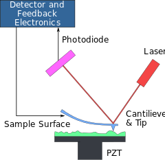

Lesson1
=======

### New methods in Neurobiology
The mechanical properties of the system are relevant, they are present in 
* growth cone
* cell differentiation
* etcc

Some new applying instruments are 
1. Optical tweezers
2. Atomic force microscopy 
The physical principle is the same of a spring, there is a linear dependence between the deformation of the spring and the force:
hook law.

The revolution of Mechanobiology is due to the hard task of measure this forces. It depends on technological ability.

Vincenzo Torre opinion: Discoveries in biology depends from technology breaktrheougths 

#### Imaging
Imaging is the superposition of many quantities and result as hard as doing other measures.
Imaging allows to have a scan of your entire brain, and have signal images of (morphology, activities, etc..) it can be dynamic and focalize on single cells too.
You can image synaptic tracking and molecules too.
Imaging can be done with photons or electrons, and they behave differently and a lot of data process is required.

Both fixed and live preparation can be imaged:
-**fixed -->**treated with some material, then died
-**live  -->**  cells are alive and can show complex behavior

In imaging the features are **temporal** and **spatial** resolution, the images are obtained with ccd camera which determines the spatial resolution, while the diffusion of calcium and decaying time of calcium excitations from metastable state of fluorescence. Time resolution high frames is 50 fps

Also dyes can be used and give better resolution, the cost is a harder experimental set, and require to acquire more than 10^3 frame pers sec.

*movies on imaging, to insert from Vincenzo Torre slides,
1. Ca+ bursting in mice brain, the image is token from a slice of brain 100um in Lvls 1-4. 
2. Ca+ higly localized signal with few neurons and glia cells
3. Fluorescent dyes:  neurite outgrowth and differentiation
4. Fluorescient dyes: Actin Wave migration*

#### Optical Tweezers

It can measure the exert by filopodia and lamellopodium on external environment.
resolution in msec and **picoNewton**:
- 1 pN in filopodium
- 10-50 pn lamellopodium
*We will have classes on Optical tweezers.* 
The base idea is to construct optical traps wich exert a linear force over the displacement of the tweezer. We can measure even the effect of a controlled force on the biologic material.
*movies*
Force in the molecules are much stronger than forces we can see. This experiments prove that mechanical stress is much more relvant in neurobiology than we thought.

####Atomic Force Microscopy
 
This instrument is really versatile and can be used for imaging *--> next lesson is about!* It can scale to 15 nm 
 

