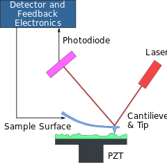
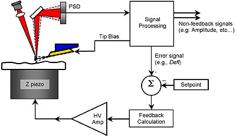

# Lesson 3: Atomic Force Microscopy.

### A short story:
AFM rise from the extension of Scanning Tunnel Microscopy to non conducting material.
First AFM implementation was in 1995.

### The idea:

- No electric or magnetic force are present.
- The only forces are of Van Der Waals type and are described from the Lennard Jones potential: $$
V_{LJ} = 4 \epsilon (\frac{\sigma}{r}^{12}-\frac{\sigma}{r}^6)
$$
So the Pauli exclusion principle plays the major role.
The surface is scanned and point to point height is detected.
A spring is behind the tip which interact with the substrate.
the nano spring is made in sylicon, there are some relation between the geometrical shape of the cantileever and the spring properties.
The smart way to measure the elongation/retraction of the spring is through a laser and a mirror! The same approach use from Sir Cavendish to measure the universal gravitational constant in 1798.

The distance between cantiliver and electronic receiver will amplify the signal

$$
k= c^{-1}= \frac{E t^3 w}{4 l^3} \\
F = k \cdot \Delta z
$$
this relation says that the spring will aumentate the force and in case of soft material this could damage the sample!
so what's needed?
**To mantain always the same force.**
A feedback mechanism is used through piezoelectric materials which elevate the tip from the sample and mantain always the same distance between the cantilever and the measured strate. Once fixed the force we want for our sample the piezoelectric can be tuned

The typical representation is a 2D colormap. The error image is usually associated and give the perception of 3D since the direction of the tip and the invetigation gives a nice image, but the afm image has more information.  

### Dynamic mode afm
The cantiliver will oscillate on resonance frequency:
- hitting the cantiliver at right frequency
- attracting magnetically the cantiliver
$$
f = \sqrt{k/m}
$$
When the cantiliver get closer to the surface it will change the oscillation frequency and we can detect this modulation
The same feedback mechanism is used to mantain the distance at the minimum of Lennard-Jones potential.
Another tecnique is the frequency modulation, which is to variate the frequency instead of the distance
Lennard-Jones attraction is linked with electron clouds oscillation and the resultant polarizaion.
It allows to do imaging without touching the sample!

#### Tapping mode
The tip taps the surface and ampltude decreases.

#### Phase imaging
The delay phase of cantiliver with oscillating piezo is 90 degrees at resonance, while a variation in frequency will affect the fase with this equation:
$$
\phi = \tan^{-1}(\frac{\omega\omega_0}/{\omega^2_0 -\omega^2})
$$
due to high derivative of phase changing near the resonance frequency the sensitivity is much higher than other methods in slowly changing surfaces

### Spatial resolution and other cons
1. the image is always the convolution of the tip shape and the sample shape.
2. the tip can be damaged during the experiments
3. Post processing of the image is required and is a pain in the ass.
